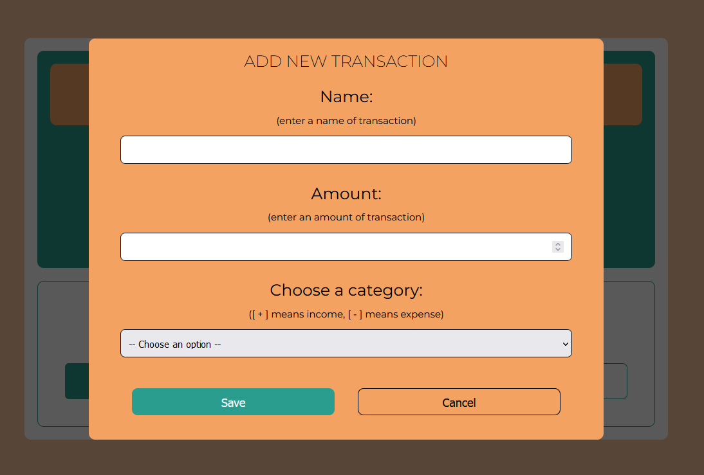

# MyWallet

## Table of contents

- [General info](#general-info)
- [Technologies](#technologies)
- [Screenshots](#screenshots)
- [JavaScript properties and methods](#javaScript-properties-and-methods)
- [Live](#live)

## General info

This application allows to manage own finances. When add transactions button is clicked popup window will appear. In this window need to be enter a name of transaction, an amount and select the transaction category. Transactions can be deleted either one by one or all of them at once.
The amount of available money, income and expenses are constantly updated.

MyWallet was written in english language.

## Technologies

- HTML
- CSS
- SASS & BEM
- Javascript

## Screenshots

- main app
      

           
      

- popup window
      

           
      

## JavaScript properties and methods

### In this project I did cover the following inbuilt JavaScript properties and methods

- reduce()
- toFixed()
- indexOf()
- push()
- parseFloat()
- createElement()
- append()
- classList
- add()
- remove()
- contains()
- trim()
- splice()
- test()
- setAttribute()
- getElementById()
- style property
- innerHTML
- lastElementChild
- textContent
- document.querySelector
- addEventListener

## Live

<a href="lilunia.github.io/MyWallet/">lilunia.github.io/MyWallet/</a>

## Problems

- when the number input contains an invalid value, I did try to retrieve the value, I got a blank string
